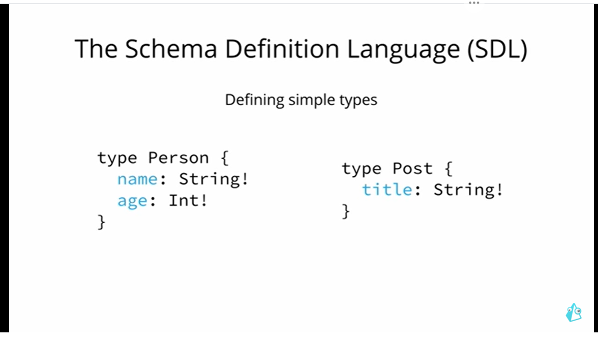
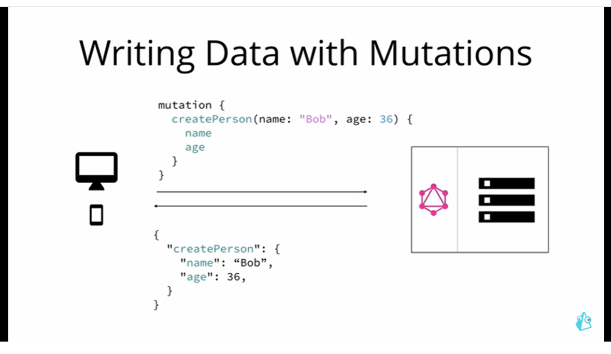

# GraphQL

### Introduction

### Benefits of using GraphQL over REST

### Core Concepts

#### ! means that the field is required.

#### Defined a one to many relation between person and post.

### Mutations

- You can receive data while sending it as well.

### Subscriptions

### Architecture

### Resolver Function

### GraphQL Clients

### Imperative and Declarative

## Getting Started
- package.json is the configuration file for the Node.js app you’re building. It lists all dependencies and other configuration options (such as scripts) needed for the app.
- ts-node-dev, which will enable you to transpile your TS files on the fly and restart your API on changes.
- Setting "strict": true enables a wide range of type checking behavior that results in more type-safe programs.
- apollo-server is a fully-featured GraphQL server. It is based on Express.js and a few other libraries to help you build production-ready GraphQL servers.
- Nexus is a library to create type-safe GraphQL schemas with a code-first approach (since you write standard JavaScript/TypeScript code to define what your schema will look like, hence “code-first”).
- At the core of every GraphQL API, there is a GraphQL schema.
- Every GraphQL schema has three special root types: Query, Mutation, and Subscription. The root types correspond to the three operation types offered by GraphQL: queries, mutations, and subscriptions. The fields on these root types are called root fields and define the available API operations.

#### GraphQL Schema
- Scalar types are the most basic types in a GraphQL schema, with no sub-fields of their own. 
- They are similar to the primitive types in programming languages. 
- GraphQL comes with a 5 default scalar types out of the box: Int, Float, String, Boolean and ID.
- However, when querying an object type, it is required that you query at least one of its fields in a selection set.
- When the type of a root field is an object type, you can further expand the query (or mutation/subscription) with fields of that object type. The expanded part is called the selection set.
- For the fields in the selection set, it doesn’t matter whether the type of the root field is required or a list.

## A Simple Query
- When working with a code-first tool like Nexus, the process will look like this:
    1. Define the components of your schema (types, fields, root object types, etc) using Nexus.
    2. Generate the GraphQL SDL and types.
    3. Implement the corresponding resolver functions for the added fields.
- objectType is used to create a new type in your GraphQL schema.
- Since index.js or index.ts is accepted as the default entry point to a folder/module in Node.js, you can export everything from the graphql folder here.
- One of the major advantages of the code-first approach is that you don’t have to worry about having your GraphQL types and your TypeScript types going out of sync. Since Nexus is the source of truth that generates both, there is no risk of the two mismatching.
- a GraphQL query consists of a number of fields that have their source in the type definitions of the GraphQL schema.
-  GraphQL libraries will also let you omit trivial resolvers and will just assume that if a resolver isn’t provided for a field, that a property of the same name should be read and returned.

## Adding a database
- Prisma is an open source database toolkit and ORM that makes it easy for developers to reason about their data and how they access it, by providing a clean and type-safe API for submitting database queries.
### Database Schema
- It has three components:
  - Data source: Specifies your database connection.
  - Generator: Indicates that you want to generate Prisma Client.
  - Data model: Defines your application models. Each model will be mapped to a table in the underlying database.
  - unlike most other SQL databases, SQLite does not have a separate server process. SQLite reads and writes directly to ordinary disk files.
  - Prisma Client contains everything you need to run queries against your database. Just like Nexus it is designed to be completely type-safe.

## Connecting The Server and Database with Prisma Client
- For this you will use the third argument in a resolver function, the context argument.
- The context argument is a plain JavaScript object that every resolver in the resolver chain can read from and write to. 
- Thus, it is basically a means for resolvers to communicate. 
- A really helpful feature is that you can already write to the context at the moment when the GraphQL server itself is being initialized.
- This means that you can attach an instance of Prisma Client to the context when initializing the server and then access it from inside our resolvers via the context argument.
- Prisma queries return Promise objects as these are asynchronous. 
- So in both resolvers you are returning a Promise. 
- This is not a problem as Apollo Server is capable of detecting and automatically resolving any Promise object that is returned from resolver functions.
